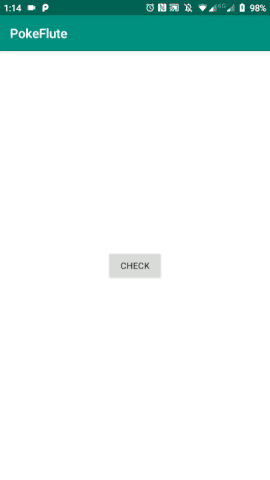

# androidPokeFlute

Here at [NearIT](https://nearit.com) we constantly pay attention to UX, user permission requests and app background functionality.
Mobile users can experience some issues caused by aggressive power management and app blocking policies imposed by smartphone vendors.
Inspired by [dontkillmyapp.com](https://dontkillmyapp.com), we want to provide an Android library that checks and handles those strange scenarios by asking the user to whitelist or protect an app.

## Installation

```groovy
implementation 'it.near.sdk:pokeflute:prealpha-1'
```

If you are experiencing any issue with resource merging or support-library compatibility, try clean/build project or:

```groovy
implementation('it.near.sdk:pokeflute:prealpha-1') {
    exclude group: 'com.android.support'
}
``` 

## Usage

We provide these useful methods:

```java
boolean potentiallyBlocked = Utils.isAppPotentiallyBlockedByManufacturer();
```
returns `true` if the manufacturer is known for using a non-standard background policy.

```java
boolean appBlockerFound = Utils.checkForAppBlockersExplicitly(context);
```
returns `true` if one of the (in)famous app killer is installed on the device.

 
Once you found out that your app could be blocked, you can start our all-in-one activity that will handle many scenarios (including many vendors and os versions).

```java
startActivity(SolutionActivity.createIntent(this));
```



## Know issues

* Missing Oppo instructions.
* Missing Vivo instructions.
* Lenovo P2 (and similar) not handled.
* Can't be aware of canDrawOverlay() on Oreo (8.0.0) devices (known Android bug https://issuetracker.google.com/issues?q=Settings.canDrawOverlays).
* English only localization
* Not sure about solution for OnePlus with Android version < P.

## Coming soon

* Investigate and handle cleaner apps such as Clean Master or Security Manager.

## Tested on

Manufacturer | Device name   | Device code | Android version | Notes
------------ | ------------- | ----------- | --------------- | ---------
Huawei       |  Mate S       |   CRR-L09   |    5.1.1        |  Protect App
Huawei       |  Honor 8      |   FRD-L09   |    6.0          |  Protect App
Huawei       |  Mate 10 pro  |   BLA-L09   |    8.0.0        |  App launch
Huawei       |  Mate 10 lite |   RNE-L21   |    8.0.0        |  App launch
Huawei       |  P8 lite 2017 |   PRA-LX1   |    7.0          |  Lock screen cleanup
Lenovo       |  K6           |   K33A48    |    7.0          |  Background app management
Motorola     |  Moto x4      |   XT1900-7  |    9.0          |  Android doze
Nokia        |  7 Plus       |   7 plus    |    9.0          |  Evenwell Power saver
OnePlus      |  OnePlus6     |   A6003     |    9.0          |  Non-standard doze
Samsung      |  Galaxy S4    |   GT-I9505  |    5.0.1        |  Pre-Nougat App Optimisation
Samsung      |  A5 (2015)    |   SM-A500FU |    6.0.1        |  Pre-Nougat App Optimisation
Samsung      |  A5 (2016)    |   SM-A510F  |    7.0          |  Nougat Unmonitored apps
Samsung      |  Core Prime   |   SM-G316F  |    5.1.1        |  Pre-Nougat App Optimisation
Samsung      |  J7 (2016)    |   SM-J710F  |    8.1.0        |  Nougat Unmonitored apps

# Want to contribute?

This is not production-ready and we are still discussing a universal UX solution.
Currently, we appreciate anyone testing the solution on various smartphones to increase the supported phones list.
In the PR, please include screenshots or video of the testing results.